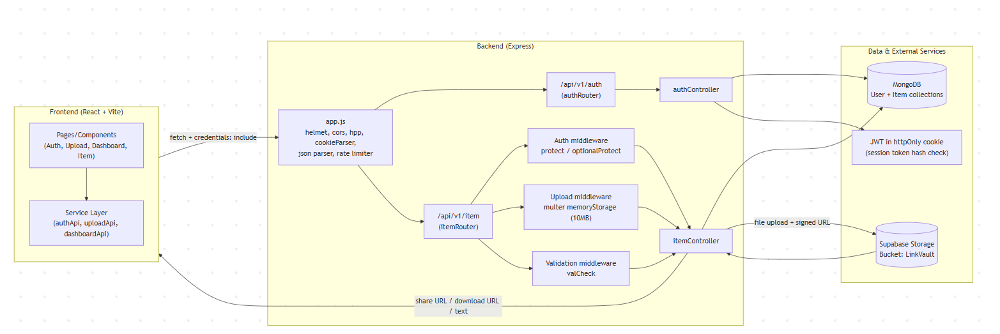

# LinkVault

LinkVault is a full-stack app for sharing short-lived text snippets and files through generated links.  
Links can be password-protected and can optionally enforce a max view count.

## Setup Instructions

### 1. Prerequisites

- Node.js 18+ (Node 20 recommended)
- npm
- MongoDB (Atlas or local)
- Supabase project with a storage bucket named `LinkVault`

### 2. Clone and install

```bash
git clone <your-repo-url>
// root level dependencies
cd LinkVault
npm i
// front end dependencies
cd frontend
npm i
cd ..
// back end dependencies
cd backend
npm i
cd ..
```

### 3. Environment configuration

Create `backend/.env` with values matching your environment:

```env
NODE_ENV=development
PORT=5000

DB=mongodb+srv://<USER>:<PASSWORD>@<HOST>/<DB_NAME>
DB_PASSWORD=<PASSWORD>

FRONT_END_URL=http://localhost:5173

SUPABASE_URL=<your-supabase-url>
SUPABASE_SERVICE_ROLE_KEY=<your-supabase-service-role-key>

# These are used to build returned local links
TEXT_DOWNLOAD_LINK=http://localhost:<PORT>/item/
FILE_DOWNLOAD_LINK=http://localhost:<PORT>/file/
```

Create `frontend/.env`:

```env
VITE_BACK_END_URL=http://localhost:5000
VITE_FRONT_END_URL=http://localhost:5173
```

### 4. Run the project

From repo root:

```bash
npm run dev
```

This starts:

- Backend on `http://localhost:5000`
- Frontend on `http://localhost:5173`

You can also run each service separately:

```bash
npm run dev:backend
npm run dev:frontend
```

## API Overview

Base path: `/api/v1/item`

### 1. Create text item

`POST /api/v1/item/plainText`

Request body (JSON):

```json
{
  "item": "hello world",
  "expiresAt": "2026-02-13T18:00:00.000Z",
  "password": "optional-password",
  "maxViews": 5
}
```

Notes:

- `item` is required.
- `expiresAt` is optional (defaults to ~10 minutes in model).
- `maxViews` is optional (`null` means unlimited).

Success response:

```json
{
  "status": "success",
  "data": {
    "url": "http://localhost:5000/item/<id>?isProtected=true&password=<PASSWORD>"
  }
}
```

### 2. Create file item

`POST /api/v1/item/file` (multipart/form-data)

Form fields:

- `file` (required)
- `expiresAt` (optional ISO datetime string)
- `password` (optional)
- `maxViews` (optional)

Notes:

- File upload limit is 10 MB.
- File is uploaded to Supabase storage bucket `LinkVault`.

Success response:

```json
{
  "status": "success",
  "data": {
    "localUrl": "http://localhost:5000/file/<id>?isProtected=true&password=<PASSWORD>"
  }
}
```

### 3. Get text item

`GET /api/v1/item/plainText/:id`

Optional query params:

- `isProtected=true`
- `password=<actual-password>`

Success response:

```json
{
  "status": "success",
  "data": {
    "text": "stored text content"
  }
}
```

### 4. Get file item

`GET /api/v1/item/file/:id`

Optional query params:

- `isProtected=true`
- `password=<actual-password>`

Success response:

```json
{
  "status": "success",
  "data": {
    "downloadUrl": "<supabase-signed-url>"
  }
}
```

## Design Decisions

1. Single `Item` model for text and file metadata  
   Text and file links share one collection. `isText` determines item type and retrieval route logic.

2. Passwords stored hashed with bcrypt  
   If a password is provided, it is hashed in a Mongoose pre-save hook and checked during retrieval.

3. Time-based expiration handled at query level  
   `itemSchema.pre(/^find/)` filters out expired documents (`expiresAt > now`) so expired links behave as unavailable.

4. Supabase signed URLs for file delivery  
   Files are uploaded once, and retrieval returns a signed URL for direct download/preview.

5. View-limiting in middleware  
   `viewsLeft` is decremented after successful validation and blocks access when it reaches zero.

6. Frontend supports optional expiry input  
   If expiry is not provided, backend defaults are used.

7. Basic abuse protection with rate limiter  
   `/api` is behind `express-rate-limit`.

## Data Flow Diagram

