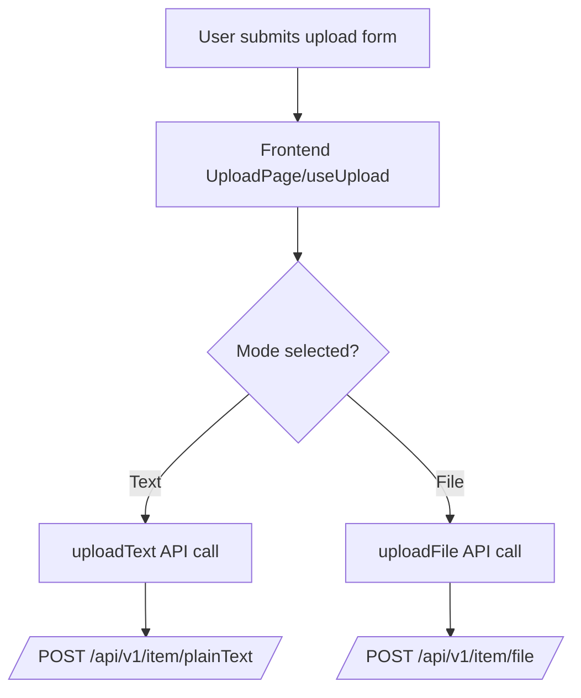

# LinkVault Data Flow (Upload to Storage)

This document shows how data moves from the user action in the frontend to persistence in MongoDB (and Supabase for files).

## 1. High-Level Upload Router



## 2. Text Upload Path (User -> MongoDB)

```mermaid
flowchart TD
    U1[User enters text + options] --> FE1[useUpload validates input]
    FE1 --> API1[frontend/services/uploadApi.uploadText]
    API1 --> REQ1[POST /api/v1/item/plainText\nJSON: item, expiresAt?, password?, maxViews?]

    REQ1 --> R1[itemRouter plainText route]
    R1 --> C1[itemController.createText]
    C1 --> T1[Prepare payload\nviewsLeft=maxViews if provided]
    T1 --> M1[Item.create(req.body)]

    M1 --> H1[Mongoose pre-save hook\nhash password if present]
    H1 --> D1[(MongoDB items collection)]

    D1 --> C2[Controller builds URL using TEXT_DOWNLOAD_LINK + _id]
    C2 --> RES1[201 response with generated text URL]
    RES1 --> FE2[Frontend stores final share link]
```

## 3. File Upload Path (User -> Supabase + MongoDB)

```mermaid
flowchart TD
    U2[User picks file + options] --> FE3[useUpload validates input]
    FE3 --> API2[frontend/services/uploadApi.uploadFile]
    API2 --> REQ2[POST /api/v1/item/file\nmultipart: file, expiresAt?, password?, maxViews?]

    REQ2 --> R2[itemRouter file route]
    R2 --> MU[multer memoryStorage\n10MB limit]
    MU --> C3[itemController.createFile]

    C3 --> S1[uploadToSupabase(req.file)]
    S1 --> SB[(Supabase bucket: LinkVault)]
    SB --> P1[filePath returned]

    P1 --> S2[getSignedUrl(filePath, duration)]
    S2 --> SU[Supabase signed URL]

    C3 --> T2[Prepare Mongo doc\nitem=filePath, url=signedUrl,\nexpiresAt?, password?, viewsLeft?]
    T2 --> M2[Item.create(data)]
    M2 --> H2[Mongoose pre-save hook\nhash password if present]
    H2 --> D2[(MongoDB items collection)]

    D2 --> C4[Controller builds local URL using FILE_DOWNLOAD_LINK + _id]
    C4 --> RES2[201 response with localUrl]
    RES2 --> FE4[Frontend stores final share link]
```

## 4. Data Stored Per Mode

### Text mode
- `item`: raw text
- `expiresAt`: provided value or model default (~10 min)
- `password`: bcrypt hash (if provided)
- `maxViews`, `viewsLeft`: optional view limits
- `isText`: default `"true"`

### File mode
- `item`: Supabase file path
- `url`: Supabase signed URL
- `expiresAt`: provided value or model default (~10 min)
- `password`: bcrypt hash (if provided)
- `maxViews`, `viewsLeft`: optional view limits
- `isText`: `"false"`
